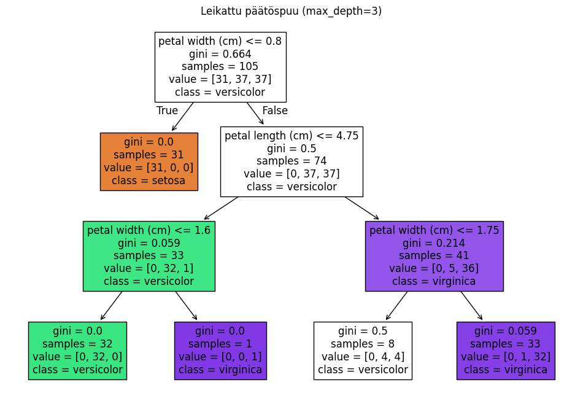

Päätöspuut ovat erinomainen lähtökohta koneoppimisen opiskeluun, koska ne ovat intuitiivisia ja visuaalisesti helposti ymmärrettäviä. Tässä muutamia perusasioita, joita voit käsitellä nuoremmalle data-analyytikolle päätöspuista:

### Päätöspuun Perusidea
- **Määritelmä**: Päätöspuu on algoritmi, jota käytetään luokitukseen ja regressioon. Se jakaa datan yhä pienempiin alaryhmiin, kunnes jokainen ryhmä on mahdollisimman homogeeninen.
- **Solmut ja haaraumat**: Päätöspuu koostuu solmuista (nodes), jotka edustavat päätöksiä tai arvoja, ja haarautumista (branches), jotka jakavat datan erilaisten ehtojen perusteella.
  - **Juurisolmu (Root Node)**: Solmu, josta jakaminen alkaa.
  - **Sisäsolmut (Internal Nodes)**: Solmuja, jotka jakavat tietoa eri haaroihin.
  - **Lehtisolmut (Leaf Nodes)**: Solmuja, jotka sisältävät päätöksen tai lopullisen ennusteen.

### Päätöspuun Toimintaperiaate
1. **Ominaisuuksien Valinta**: Päätöspuu valitsee ominaisuudet (esim. ikä, tulot, asuinalue) jakamalla dataa siten, että syntyvät ryhmät ovat mahdollisimman samanlaisia.
2. **Jakokriteerit**: Yleisiä jakokriteerejä ovat:
   - **Gini-indeksi**: Mittaa epäpuhtautta solmussa. Pieni arvo tarkoittaa homogeenista ryhmää.
   - **Entropia ja informaatiovoitto**: Entropia mittaa epävarmuutta, ja informaatiovoitto kertoo, kuinka paljon tietoa lisäys tuo.

### Päätöspuun Rakentaminen
- **Recursive Partitioning**: Päätöspuu käyttää rekursiivista jakamista, kunnes saavutetaan määritetty syvyys tai solmut ovat tarpeeksi homogeenisia.
- **Leikkaaminen (Pruning)**: Jotta vältetään ylisovittaminen (overfitting), voidaan puu leikata lyhyemmäksi poistamalla vähiten merkityksellisiä solmuja.

### Plussat ja Miinukset
- **Plussat**: Päätöspuut ovat helposti tulkittavia ja vaativat vain vähän esikäsittelyä datalle.
- **Miinukset**: Päätöspuut voivat olla herkkiä ylisovittamiselle, varsinkin jos ne ovat liian syviä. Lisäksi ne voivat olla epävakaita, sillä pienet muutokset datassa voivat muuttaa puun rakennetta merkittävästi.

### Käytännön Esimerkki
Käytä esimerkiksi **sklearn**-kirjastoa Pythonissa opettaaksesi päätöspuun rakentamista:

```python
from sklearn.datasets import load_iris
from sklearn.tree import DecisionTreeClassifier
from sklearn import tree
import matplotlib.pyplot as plt

# Ladataan esimerkkidata
data = load_iris()
X, y = data.data, data.target

# Päätöspuun malli
model = DecisionTreeClassifier()
model.fit(X, y)

# Piirretään päätöspuu
plt.figure(figsize=(12, 8))
tree.plot_tree(model, filled=True, feature_names=data.feature_names, class_names=data.target_names)
plt.show()
```


Tässä esimerkissä käytetään Iris-datasarjaa, jonka avulla voidaan helposti havainnollistaa, kuinka päätöspuu oppii ja tekee päätöksiä eri kukkalajien perusteella.

### Keskustelukysymyksiä

- **Mitkä ovat Gini-indeksin ja entropian erot, ja milloin niitä kannattaa käyttää?**


Voit aloittaa näillä perusasioilla ja näyttää käytännön esimerkin Python-koodista. Haluatko, että laadin lisää esimerkkejä tai kysymyksiä opiskeluun liittyen?


Gini-indeksi ja entropia ovat kaksi suosittua mittaria, joita käytetään päätöspuissa jakamiskriteereinä solmun epäpuhtauden mittaamiseen. Niiden avulla päätöspuu määrittää, mikä ominaisuus valitaan jakamiseen kullakin solmun tasolla. Tässä yksityiskohtia kummastakin ja vertailu niiden käytöstä:

### Gini-indeksi
- **Määritelmä**: Gini-indeksi mittaa solmun epäpuhtautta. Sen arvo vaihtelee välillä 0–1, jossa 0 tarkoittaa täysin homogeenista ryhmää (kaikki kuuluvat samaan luokkaan) ja arvo lähellä 1 viittaa heterogeenisempään ryhmään.
- **Laskentakaava**: Gini-indeksi lasketaan seuraavasti:
  \[
  Gini = 1 - \sum_{i=1}^{n} p_i^2
  \]
  jossa \( p_i \) on i:nnen luokan todennäköisyys. Mitä pienempi Gini-arvo, sitä homogeenisempi ryhmä.

- **Edut**:
  - Laskennallisesti nopeampi kuin entropia, sillä se ei sisällä logaritmeja.
  - Yleisesti käytetään luokituksessa, kun vaaditaan nopeaa suoritusta.

### Entropia ja Informaatiovoitto
- **Määritelmä**: Entropia mittaa epävarmuutta tai epäjärjestystä solmussa. Jos kaikki näytteet kuuluvat samaan luokkaan, entropian arvo on 0, kun taas maksimiepävarmuuden vallitessa (näytteet jakautuvat tasaisesti eri luokkiin) entropian arvo on korkea.
- **Laskentakaava**: Entropia lasketaan seuraavasti:
  \[
  Entropia = - \sum_{i=1}^{n} p_i \log_2(p_i)
  \]
  jossa \( p_i \) on i:nnen luokan todennäköisyys. Informaatiovoitto määritetään sitten vähentämällä entropian arvo ennen jakamista entropian arvoista, jotka saadaan jakamisen jälkeen.

- **Edut**:
  - Entropia huomioi tarkemmin epävarmuuden ja voi joskus johtaa paremmin tasapainotettuun puuhun.
  - Hyvä vaihtoehto, kun on tärkeää ymmärtää kaikkien eri luokkien erottelukyky mahdollisimman tarkasti.

### Erot ja Käyttötapaukset
- **Laskennallinen ero**: Gini-indeksi on laskennallisesti yksinkertaisempi, koska se ei sisällä logaritmifunktioita, jotka voivat olla suhteellisen raskaita. Tästä syystä se on yleensä hieman nopeampi valinta, ja sen vuoksi suositumpi erityisesti suurten datasarjojen kanssa.
- **Valintakriteeri**:
  - Gini-indeksi on intuitiivinen ja nopea, ja se pyrkii vähentämään heterogeenisyyttä mahdollisimman nopeasti. Usein käytetään **CART (Classification and Regression Tree)** -menetelmässä.
  - Entropia antaa syvällisemmän käsityksen epävarmuudesta ja voi joskus tuottaa hieman erilaisen puun rakenteen kuin Gini. Entropiaa käytetään erityisesti **ID3** ja **C4.5**-algoritmeissa.

### Käyttösuositukset
- **Gini-indeksi**: Valitse Gini, kun haluat nopean ja laskennallisesti kevyemmän ratkaisun, eikä solmujen tarkka epävarmuuden arviointi ole kriittistä.
- **Entropia**: Käytä entropiaa, jos haluat varmistaa paremman tasapainon ja ymmärtää tarkemmin jakautumien välillä olevaa epävarmuutta.

Käytännössä molemmat antavat usein samankaltaisia tuloksia päätöspuille, ja ero niiden välillä on yleensä vähäinen. Gini-indeksi on monesti suosituin valinta, koska se on hieman yksinkertaisempi ja nopeampi, kun taas entropia voi olla hyvä valinta monimutkaisemmissa tilanteissa, joissa epävarmuuden arvioinnilla on merkittävä rooli.

Voisiko tämä olla hyvä pohja keskustelulle oppilaan kanssa, ja haluatko ehkä tehdä käytännön esimerkin, jossa kokeilette molempia mittareita?

- **Miten leikkaaminen voi auttaa parantamaan päätöspuun yleistävyyttä?**

Leikkaaminen (pruning) on keskeinen menetelmä, jolla päätöspuun ylisovittamista (overfitting) voidaan estää ja siten parantaa sen kykyä yleistää uusiin, aiemmin näkymättömiin tietoihin. Tässä on yksityiskohtaisempi katsaus siitä, miten leikkaaminen auttaa parantamaan päätöspuun yleistävyyttä:

### Ylisovittaminen Päätöspuissa
- **Ylisovittaminen** tapahtuu, kun päätöspuu oppii liikaa yksityiskohtia koulutusdatasta, mukaan lukien kohinaa ja satunnaisia poikkeamia.
- Ylisovitettu päätöspuu on hyvin monimutkainen ja sillä on paljon solmuja, jotka voivat olla täysin satunnaisten poikkeamien aiheuttamia.
- Tällainen puu saattaa antaa hyviä tuloksia koulutusdatalla, mutta sen ennustustarkkuus laskee merkittävästi testidatalla, koska se ei pysty yleistämään hyvin.

### Leikkaamisen Tavoite
- **Leikkaamisen (pruning)** tarkoituksena on yksinkertaistaa päätöspuuta poistamalla sen liialliset solmut ja oksat, jotka eivät paranna puun suorituskykyä.
- Tämä tehdään, jotta puusta tulee **vähemmän monimutkainen ja vähemmän herkkä** datan satunnaisille poikkeamille.
- Leikkaaminen auttaa puuta keskittymään **tärkeimpiin jakamisiin**, jotka todella vaikuttavat lopputulokseen, ja jättämään huomiotta kohinaa.

### Leikkaamisen Tyypit
1. **Ennakoiva leikkaaminen (Pre-pruning)**:
   - Ennakoiva leikkaaminen tarkoittaa sitä, että pysäytetään puun kasvu ennen kuin se saavuttaa täyden syvyytensä.
   - Esimerkiksi asetetaan jokin rajoitus, kuten **maksimisyvyys**, **vähimmäisnäytemäärä solmussa**, tai **minimijakautumisparannus**, ennen kuin uusia jakautumia tehdään.
   - Tämä auttaa pitämään puun yksinkertaisena jo rakennusvaiheessa ja estää liian monimutkaisten solmujen syntymisen.

2. **Jälkikäteinen leikkaaminen (Post-pruning)**:
   - Jälkikäteinen leikkaaminen tehdään sen jälkeen, kun puu on ensin kasvanut täyteen mittaansa.
   - Tällöin analysoidaan valmiin puun oksia ja **poistetaan sellaisia oksia**, joiden poistaminen ei heikennä puun suorituskykyä (tai jopa parantaa sitä).
   - Yksi yleisimmistä jälkikäteisen leikkaamisen tavoista on **karsia oksia**, jotka eivät tuo merkittävää lisäarvoa lopullisessa ennustuksessa.

### Yleistämisen Parantaminen
- **Vähemmän Herkkä Kohinalle**: Leikkaaminen poistaa puun syvimmät oksat, jotka usein vastaavat yksittäisistä poikkeamista koulutusdatassa. Tämä vähentää riskiä ylisovittaa satunnaisiin kohinoihin.
- **Parempi Testisuorituskyky**: Leikkaaminen auttaa pitämään mallin **yksinkertaisempana**, mikä yleensä parantaa sen kykyä yleistää uusiin datapisteisiin. Yksinkertainen malli ei välttämättä sovi täydellisesti koulutusdataan, mutta se todennäköisemmin tekee parempia ennusteita testidatan kanssa.
- **Kompleksisuuden Hallinta**: Pienempi, vähemmän monimutkainen päätöspuu on helpompi tulkita ja hallita. Se ei vain auta yleistämisessä, vaan on myös **tulkittavampi** ja helpommin selitettävissä.

### Esimerkki
Oletetaan, että opetat oppilaallesi, kuinka päätöspuu ylisovittaa, jos sille annetaan liikaa vapautta. Voitte käyttää Pythonin **scikit-learn**-kirjastoa ja asettaa päätöspuulle syvyyden rajoituksia, ja sitten verrata eri mallien suorituskykyä testidatalla:

```python
from sklearn.datasets import load_iris
from sklearn.tree import DecisionTreeClassifier
from sklearn.model_selection import train_test_split
from sklearn.metrics import accuracy_score

# Ladataan data ja jaetaan se koulutus- ja testijoukkoihin
data = load_iris()
X_train, X_test, y_train, y_test = train_test_split(data.data, data.target, test_size=0.3, random_state=42)

# Päätöspuu ilman leikkaamista (ylisovitettu)
model_full = DecisionTreeClassifier()
model_full.fit(X_train, y_train)
y_pred_full = model_full.predict(X_test)
print(f"Täyden puun tarkkuus: {accuracy_score(y_test, y_pred_full):.2f}")

# Päätöspuu, jossa maksimisyvyys on rajoitettu (leikkaus)
model_pruned = DecisionTreeClassifier(max_depth=3)
model_pruned.fit(X_train, y_train)
y_pred_pruned = model_pruned.predict(X_test)
print(f"Leikatun puun tarkkuus: {accuracy_score(y_test, y_pred_pruned):.2f}")
```
from sklearn.model_selection import cross_val_score

# Eri syvyyksien testaus
for depth in [3, 5, None]:  # None tarkoittaa täyttä syvyyttä ilman leikkaamista
    model = DecisionTreeClassifier(max_depth=depth)
    scores = cross_val_score(model, X_train, y_train, cv=5)
    print(f"Max_depth={depth} - Cross Validation - Keskimääräinen tarkkuus: {scores.mean():.2f}")


Tässä esimerkissä voidaan nähdä, kuinka rajoittamalla päätöspuun syvyyttä voimme parantaa mallin kykyä yleistää testidatan kanssa. Tämä on konkreettinen tapa osoittaa, kuinka leikkaaminen voi parantaa yleistettävyyttä ja estää ylisovittamisen.

# käytännön harjoituksia

Tässä on muutama käytännön harjoitus, joita voit käyttää nuoremman data-analyytikon kanssa, kun harjoittelette päätöspuun leikkaamista ja sen vaikutusta mallin suorituskykyyn:

### 1. **Kokeile Useita Leikkausmenetelmiä**
Pyydäta kokeilemaan eri tapoja leikkaamiseen käyttämällä **max_depth**, **min_samples_split**, ja **min_samples_leaf** -parametreja scikit-learnin DecisionTreeClassifier-luokassa. Tarkoituksena on nähdä, miten eri rajoitukset vaikuttavat puun monimutkaisuuteen ja yleistämiskykyyn. Voit tehdä tämän seuraavasti:

```python
from sklearn.datasets import load_iris
from sklearn.tree import DecisionTreeClassifier
from sklearn.model_selection import train_test_split
from sklearn.metrics import accuracy_score

# Ladataan Iris-data
data = load_iris()
X_train, X_test, y_train, y_test = train_test_split(data.data, data.target, test_size=0.3, random_state=42)

# Leikattujen mallien vertailu
parametrien_yhdistelmat = [
    {"max_depth": 3},
    {"min_samples_split": 4},
    {"min_samples_leaf": 5}
]

for params in parametrien_yhdistelmat:
    model = DecisionTreeClassifier(**params)
    model.fit(X_train, y_train)
    y_pred = model.predict(X_test)
    print(f"Leikkausparametrit {params} - Tarkkuus: {accuracy_score(y_test, y_pred):.2f}")
```
from sklearn.model_selection import cross_val_score

# Eri syvyyksien testaus
for depth in [3, 5, None]:  # None tarkoittaa täyttä syvyyttä ilman leikkaamista
    model = DecisionTreeClassifier(max_depth=depth)
    scores = cross_val_score(model, X_train, y_train, cv=5)
    print(f"Max_depth={depth} - Cross Validation - Keskimääräinen tarkkuus: {scores.mean():.2f}")


Tämän harjoituksen avulla voi kokeilla, miten erilaiset parametrit, kuten **maksimisyvyys** (max_depth), **minimijaon näytemäärä** (min_samples_split), ja **lehtisolmun miniminäytteet** (min_samples_leaf), vaikuttavat puun yksinkertaisuuteen ja sen suorituskykyyn.

### 2. **Visualisoi Päätöspuun Leikkaaminen**
Päätöspuun visualisointi ennen ja jälkeen leikkaamisen auttaa nuorta analyytikkoa ymmärtämään, kuinka leikkaaminen vaikuttaa puun rakenteeseen. Voitte käyttää samoja parametreja, mutta visualisoida puun, jotta nähdään ero monimutkaisessa ja yksinkertaisemmassa puussa:

```python
import matplotlib.pyplot as plt
from sklearn import tree

# Täysi päätöspuu ilman leikkaamista
full_tree = DecisionTreeClassifier()
full_tree.fit(X_train, y_train)

plt.figure(figsize=(12, 8))
tree.plot_tree(full_tree, filled=True, feature_names=data.feature_names, class_names=data.target_names)
plt.title("Täysi päätöspuu")
plt.show()

# Leikattu päätöspuu (syvyys rajoitettu)
pruned_tree = DecisionTreeClassifier(max_depth=3)
pruned_tree.fit(X_train, y_train)

plt.figure(figsize=(12, 8))
tree.plot_tree(pruned_tree, filled=True, feature_names=data.feature_names, class_names=data.target_names)
plt.title("Leikattu päätöspuu (max_depth=3)")
plt.show()
```


Tämän avulla voi nähdä konkreettisesti, miten leikkaaminen yksinkertaistaa puuta.

### 3. **Vertailu Koulutus- ja Testivirheiden Välillä**
Käyttäkää useita päätöspuumalleja ja vertailekaa koulutus- ja testivirheitä. Tämä auttaata ymmärtämään, miten ylisovittaminen ilmenee. Tavoitteena on selittää, miksi ylisovittaminen johtaa suureen eroon koulutus- ja testivirheiden välillä, kun taas hyvin leikattu puu antaa samankaltaiset virheprosentit kummallekin:

```python
import numpy as np

# Eri maksimi syvyyksiä
syvyyksiä = np.arange(1, 10)

# Tallennetaan koulutus- ja testivirheet
train_errors = []
test_errors = []

for depth in syvyyksiä:
    model = DecisionTreeClassifier(max_depth=depth)
    model.fit(X_train, y_train)
    
    # Lasketaan virheet
    train_errors.append(1 - accuracy_score(y_train, model.predict(X_train)))
    test_errors.append(1 - accuracy_score(y_test, model.predict(X_test)))

# Piirretään virheet
plt.plot(syvyyksiä, train_errors, label='Koulutusvirhe', marker='o')
plt.plot(syvyyksiä, test_errors, label='Testivirhe', marker='o')
plt.xlabel('Puun maksimi syvyys')
plt.ylabel('Virheprosentti')
plt.legend()
plt.title('Puun syvyyden vaikutus koulutus- ja testivirheisiin')
plt.show()
```


Tässä visualisoidaan koulutus- ja testivirheiden ero eri syvyyksillä. Kun syvyys kasvaa, koulutusvirhe pienenee, mutta testivirhe voi kasvaa ylisovittamisen seurauksena. Tämä auttaata ymmärtämään, miksi yksinkertaisempi malli voi olla parempi yleistämisessä.

### 4. **K-Fold Cross Validation Leikkaamisen Apuvälineenä**
Yksi tärkeä menetelmä, jonka voi oppia, on **K-Fold Cross Validation**. Tämän avulla voidaan arvioida eri päätöspuumallien yleistämiskykyä käyttämällä kertaalleen jaettua dataa. Esimerkiksi:

```python
from sklearn.model_selection import cross_val_score

# Eri syvyyksien testaus
for depth in [3, 5, None]:  # None tarkoittaa täyttä syvyyttä ilman leikkaamista
    model = DecisionTreeClassifier(max_depth=depth)
    scores = cross_val_score(model, X_train, y_train, cv=5)
    print(f"Max_depth={depth} - Cross Validation - Keskimääräinen tarkkuus: {scores.mean():.2f}")
```

from sklearn.model_selection import cross_val_score

# Eri syvyyksien testaus
for depth in [3, 5, None]:  # None tarkoittaa täyttä syvyyttä ilman leikkaamista
    model = DecisionTreeClassifier(max_depth=depth)
    scores = cross_val_score(model, X_train, y_train, cv=5)
    print(f"Max_depth={depth} - Cross Validation - Keskimääräinen tarkkuus: {scores.mean():.2f}")


K-Fold Cross Validation auttaa arvioimaan mallin luotettavuutta eri syvyyksillä ja auttaa valitsemaan optimaalisen syvyyden ilman liiallista ylisovittamista. Tämä on hyvä tapa näyttää, miten mallin hyperparametrit voidaan valita objektiivisesti.

### Yhteenveto
- päätöspuun leikkaaminen estää ylisovittamisen ja parantaa yleistämistä.
- Visualisointi auttaa ymmärtämään leikkaamisen vaikutusta puun rakenteeseen.
- Virheiden vertailu koulutus- ja testidatassa havainnollistaa ylisovittamisen vaikutuksia.
- K-Fold Cross Validation opettaa, miten valita optimaalinen mallin syvyys objektiivisesti.

Voit kokeilla näitä harjoituksia ja nähdä, mitkä auttavat parhaitenta ymmärtämään päätöspuiden toimintaa ja leikkaamisen merkitystä. Tarvitsetko lisätietoja jostakin näistä harjoituksista?

